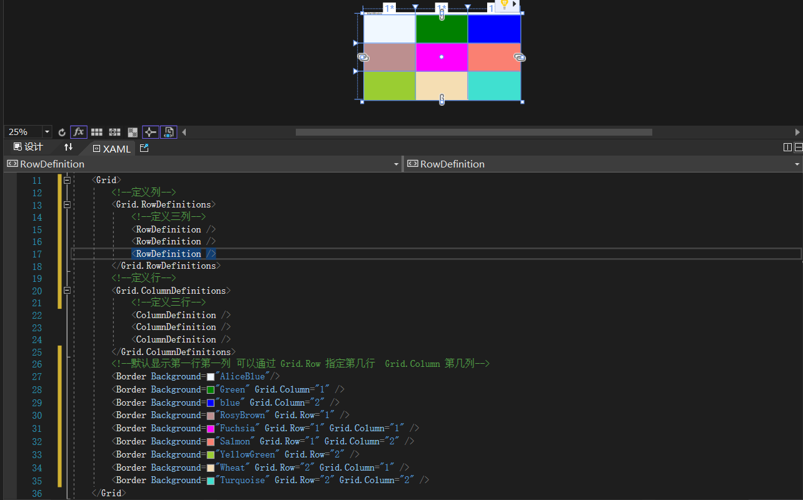
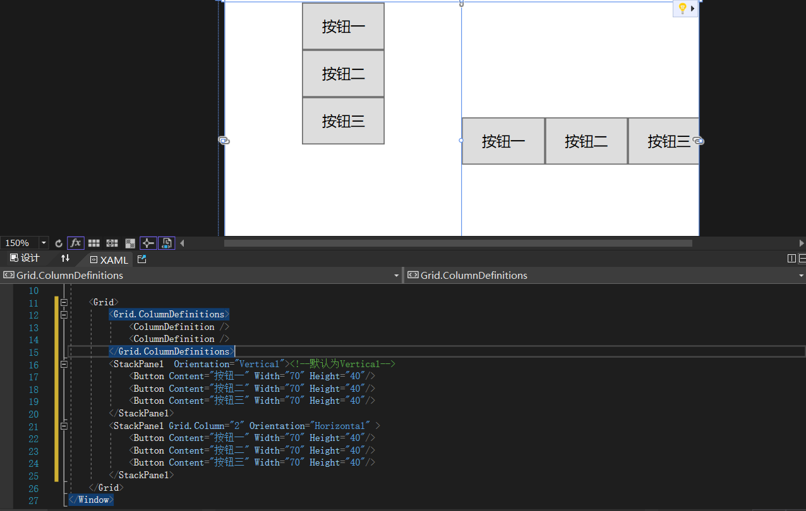
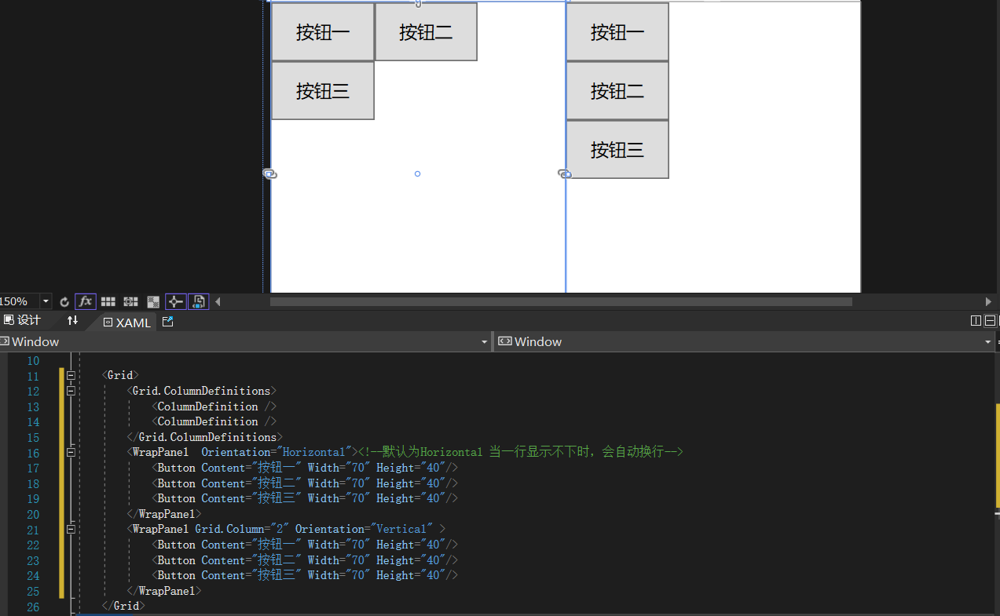
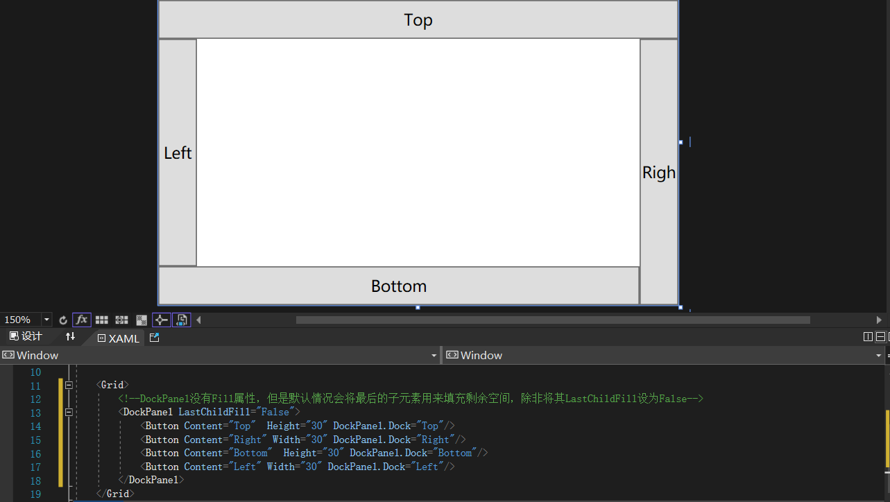
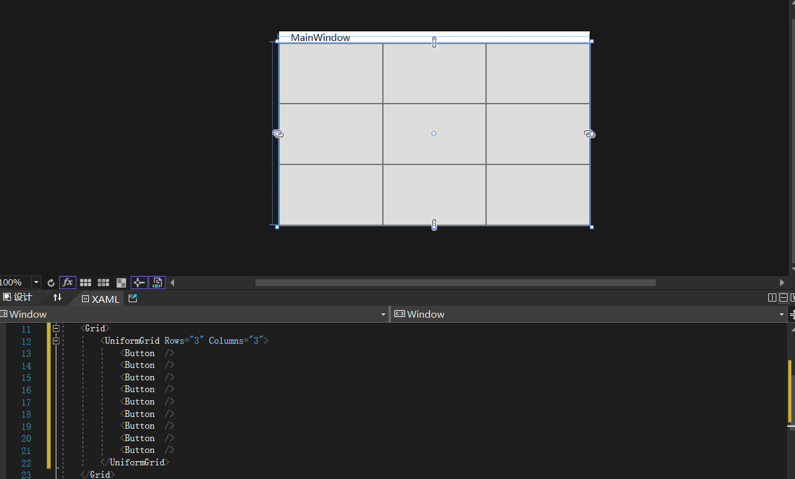

# WPF 常见布局方式

> ##### 1. Grid布局

```Grid
Grid是WPF默认布局空间，它的效果类似html中的Table，只不过在外观上Grid默认是没有边框的。
```

```C#
    <Grid>
        <!--定义列-->
        <Grid.RowDefinitions>
            <!--定义三列-->
            <RowDefinition />
            <RowDefinition />
            <RowDefinition />
        </Grid.RowDefinitions>
        <!--定义行-->
        <Grid.ColumnDefinitions>
            <!--定义三行-->
            <ColumnDefinition />
            <ColumnDefinition />
            <ColumnDefinition />
        </Grid.ColumnDefinitions>
        <!--默认显示第一行第一列 可以通过 Grid.Row 指定第几行  Grid.Column 第几列-->
        <Border Background="AliceBlue"/>
        <Border Background="Green" Grid.Column="1" />
        <Border Background="blue" Grid.Column="2" />
        <Border Background="RosyBrown" Grid.Row="1" />
        <Border Background="Fuchsia" Grid.Row="1" Grid.Column="1" />
        <Border Background="Salmon" Grid.Row="1" Grid.Column="2" />
        <Border Background="YellowGreen" Grid.Row="2" />
        <Border Background="Wheat" Grid.Row="2" Grid.Column="1" />
        <Border Background="Turquoise" Grid.Row="2" Grid.Column="2" />
    </Grid>
```

> ##### 2. StackPanel布局

```StackPanel
StackPanel默认的情况下，它的子元素会从上到下排列，可以控制它的Orientation属性控制排列方向。Orientation属性有两个值一个Horizontal，一个是Vertical（默认）,StackPanel不会自动换行换列，默认为Vertical
```

```C#
    <Grid>
        <Grid.ColumnDefinitions>
            <ColumnDefinition />
            <ColumnDefinition />
        </Grid.ColumnDefinitions>
        <StackPanel  Orientation="Vertical"><!--默认为Vertical-->
            <Button Content="按钮一" Width="70" Height="40"/>
            <Button Content="按钮二" Width="70" Height="40"/>
            <Button Content="按钮三" Width="70" Height="40"/>
        </StackPanel>
        <StackPanel Grid.Column="2" Orientation="Horizontal" >
            <Button Content="按钮一" Width="70" Height="40"/>
            <Button Content="按钮二" Width="70" Height="40"/>
            <Button Content="按钮三" Width="70" Height="40"/>
        </StackPanel>
    </Grid>
```

> ##### 3. WrapPanel布局

```WrapPanel
WrapPanel和StackPanel类似,WrapPanel会自动换行换列，默认为Horizontal
```

```C#
    <Grid>
        <Grid.ColumnDefinitions>
            <ColumnDefinition />
            <ColumnDefinition />
        </Grid.ColumnDefinitions>
        <WrapPanel  Orientation="Horizontal"><!--默认为Horizontal-->
            <Button Content="按钮一" Width="70" Height="40"/>
            <Button Content="按钮二" Width="70" Height="40"/>
            <Button Content="按钮三" Width="70" Height="40"/>
        </WrapPanel>
        <WrapPanel Grid.Column="2" Orientation="Vertical" >
            <Button Content="按钮一" Width="70" Height="40"/>
            <Button Content="按钮二" Width="70" Height="40"/>
            <Button Content="按钮三" Width="70" Height="40"/>
        </WrapPanel>
    </Grid>
```

> ##### 4. DockPanel布局

```DockPanel
DockPanel可以让元素停靠在面板的某一边，然后拉伸元素以填满全部的宽度或高度。它有一个Dock属性用来设置停靠的位置，有Left、Top、Right和Bottom四个值
```

```C#
    <Grid>
        <!--DockPanel没有Fill属性，但是默认情况会将最后的子元素用来填充剩余空间，除非将其LastChildFill设为False-->
        <DockPanel LastChildFill="False">
            <Button Content="Top"  Height="30" DockPanel.Dock="Top"/>
            <Button Content="Right" Width="30" DockPanel.Dock="Right"/>
            <Button Content="Bottom"  Height="30" DockPanel.Dock="Bottom"/>
            <Button Content="Left" Width="30" DockPanel.Dock="Left"/>
        </DockPanel>
    </Grid>
```

> ##### 5. UniformGrid布局

```UniformGrid
DockPanel可以让元素停靠在面板的某一边，然后拉伸元素以填满全部的宽度或高度。它有一个Dock属性用来设置停靠的位置，有Left、Top、Right和Bottom四个值
```

```C#
    <Grid>
        <UniformGrid Rows="3" Columns="3">
            <Button  />
            <Button  />
            <Button  />
            <Button  />
            <Button  />
            <Button  />
            <Button  />
            <Button  />
            <Button  />
        </UniformGrid>
    </Grid>
```