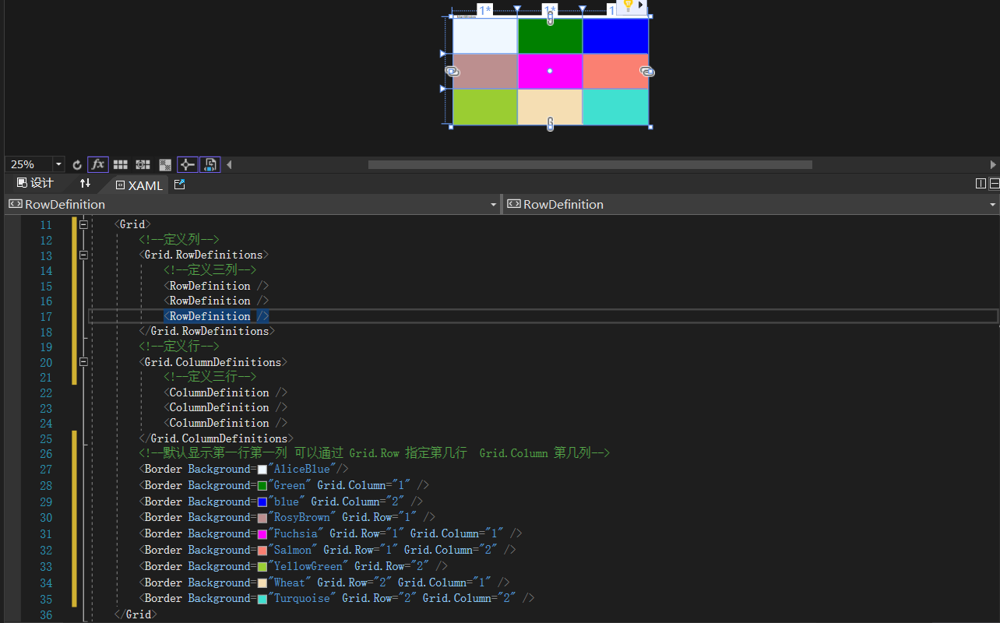

# WPF 资源
> 静态资源、动态资源介绍
```
静态资源：不会发生变化，第一次生效，后面修改也不生效
动态资源：每次修改后都会生效
```

``` xaml
    <Window.Resources>
        <SolidColorBrush x:Key="solidColorBrush" Color="Aqua"></SolidColorBrush>
    </Window.Resources>
    <Grid>
        <StackPanel>
            <Button  Content="按钮一" Background="{StaticResource solidColorBrush}" Margin="10" />
            <Button  Content="按钮二"  Background="{DynamicResource solidColorBrush}" Margin="10" />
            <Button  Content="修改" Click="Button_Click" Margin="10,0"></Button>
        </StackPanel>
    </Grid>
```
``` cs
        private void Button_Click(object sender, RoutedEventArgs e)
        {
            this.Resources["solidColorBrush"] = new SolidColorBrush(Colors.Red);
        }
```


> 资源字典
```
 1 新建资源字典，添加对应的样式
 2 在App.xaml中引入
```

```MainWindow.xaml
    <Grid>
        <StackPanel>
            <Button  Content="按钮一" Background="{StaticResource solidColorBrush}" Margin="10" />
            <Button  Content="按钮二"  Background="{DynamicResource solidColorBrush}" Margin="10" />
            <Button  Content="修改" Style="{StaticResource ButtonStyle}" Click="Button_Click"></Button>
        </StackPanel>
    </Grid>
```

```ButtonStyle.xaml
<ResourceDictionary xmlns="http://schemas.microsoft.com/winfx/2006/xaml/presentation"
                    xmlns:x="http://schemas.microsoft.com/winfx/2006/xaml">
    <SolidColorBrush x:Key="solidColorBrush" Color="Aqua"></SolidColorBrush>

    <Style x:Key="ButtonStyle" TargetType="Button">
        <Setter Property="Width" Value="100" />
        <Setter Property="Background" Value="Bisque" />
        <Setter Property="FontSize" Value="30" />
    </Style>
</ResourceDictionary>
```

```App.xaml
    <Application.Resources>
        <ResourceDictionary>
            <ResourceDictionary.MergedDictionaries>
                <ResourceDictionary Source="ButtonStyle.xaml" />
            </ResourceDictionary.MergedDictionaries>
        </ResourceDictionary>
    </Application.Resources>
```