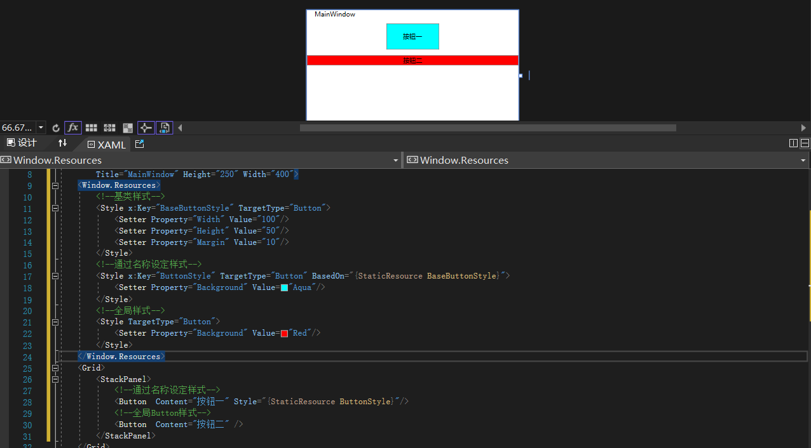

# WPF 样式


```C#
    <Window.Resources>
        <!--基类样式-->
        <Style x:Key="BaseButtonStyle" TargetType="Button">
            <Setter Property="Width" Value="100"/>
            <Setter Property="Height" Value="50"/>
            <Setter Property="Margin" Value="10"/>
        </Style>
        <!--通过名称设定样式-->
        <Style x:Key="ButtonStyle" TargetType="Button" BasedOn="{StaticResource BaseButtonStyle}">
            <Setter Property="Background" Value="Aqua"/>
        </Style>
        <!--全局样式-->
        <Style TargetType="Button">
            <Setter Property="Background" Value="Red"/>
        </Style>
    </Window.Resources>
    <Grid>
        <StackPanel>
            <!--通过名称设定样式-->
            <Button  Content="按钮一" Style="{StaticResource ButtonStyle}"/>
            <!--全局Button样式-->
            <Button  Content="按钮二" />
        </StackPanel>
    </Grid>
```